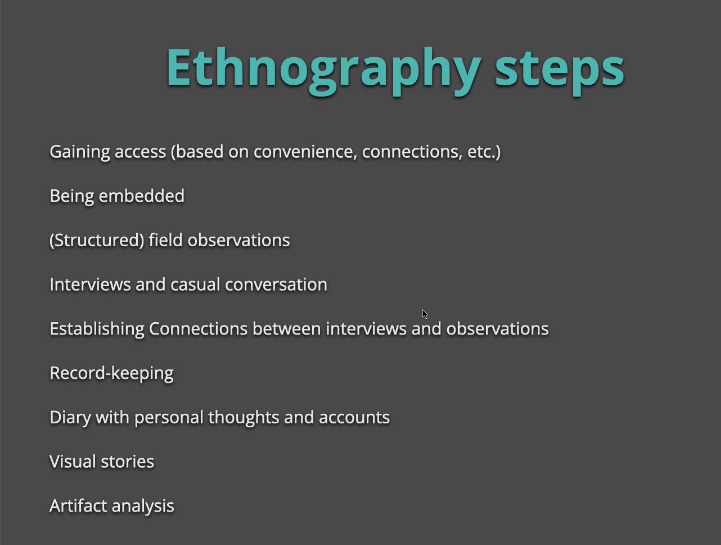

# Understanding users

- Surveys : surveymonkey, googleforms, typeforms etc
	- Never ask for solutions
	- Be specific in questions
	- Textual responses are manageable in surveys of small size
	- Free form is better in certain cases
	- Yes / No type of questions would be good
	- Is Red / Green interface better
	- There can also be variations in ratings. ie, they are not normalized

- Observations : Observing participants in their natural settings without any intervention
	- It reflects the real environment
	- It may not be very deep
	- Howeer, it needs physical presence

- Probes : Alter the environment in some way and see how people react to it. 
	- Eg : Google Fibre was scaled out for free to understand the users change in behaviour

- Diary studies : Carry a diary and record incidents of interest
	- Incident could be gathered automatically or manually
	- Eg : How often users restart browser, can be tracked automatically
	- This can be used to analyse systematic patterns. 
	- Things have to recorded as and when they happen

- DRM : Daily Reconstruction Method : Tells participants to erconstruct all episodes from the previous dat and emotion abbout each of them

- ESM : Experience Sampling method - Periodically interrupts participants and asks them to ercord something Eg : Emotions

- Interviews : 
	- A good inteviewer should be empathetic, supportive, observant, open-ended
	- Never miss a chance to talk to anyone from a different background
	- Do not ask questions like Do you use Whatsapp? Rather ask 'What apps do you use?'
	- Open ended questions give more information
	- You can start with close ended questions to put the ubject at ease and then ask open ended questions
	- Talk to experts or users with different view points
	- For people with limited time, iwill be good to send a preview of what you would like to discuss so that they can me prepared

- Contextual enquiry : To understand users in a natural environment
	- Shadowing with a sturtcure to it

- Ethnography : Qualitative research method taking into account social life and culture in some setting
	- Used to study populationfrom outside
	- Ethnographic teams does the survey and everyone can use this
	- Descriptive, Holistic and details are understood in a natural setting
	- 

The idea of probes and diary studies is interesting. Needs to be thought about. 